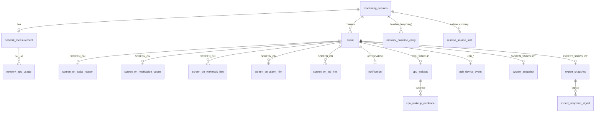

# Room 3 migration plan — event storage

Status: implemented (steps 1–6, see §9 for deviations from this plan).
Scope: replace the SharedPreferences JSON/text stores (`EventStore`,
`SessionArchiveStore`, `NotificationStore`) with a Room 3 / SQLite database
that stores only typed facts. No on-device data migration: old prefs are
deleted on first start of the new version.

## 1. Goals and rules

1. **No user-visible text in the database.** No titles, no "Label: value"
   lines, no localized display names. Everything the UI shows is rendered at
   read time from typed columns + string resources.
2. **No JSON and no text that has to be parsed.** Every fact the app reads
   back gets its own column or child table. Enums are stored as their
   `name` (TEXT, stable, readable in a DB browser).
3. **Allowed raw text** = data coming from the system or other apps, stored
   verbatim and never parsed for meaning by our own labels: package names,
   wakelock/alarm tags, job service names, `WAKE_REASON_*` values, dumpsys
   state tokens, exception messages, third-party notification title/text,
   and the user's own session note.
4. Everything that is derivable from stored facts is **derived, not stored**
   (confidence, relation "companion vs. possible trigger", unexplained flag,
   wake reason category, snapshot classification, display names).
5. Main thread never touches the DB; UI observes `Flow`s instead of polling.

What goes away as a consequence: `LocalizedText.kt`, every
`startsWithAny/containsAny/removeAnyPrefix` call (~135 call sites),
`parseCpuWakeDurationMillis`, `parseFormattedBytes`, `extractSystemHintSections`,
`buildCausalChain`'s text parser, the label-only string resources
(`timeline_prefix_*`, `main_label_*`, `main_match_*`, `event_label_*` used only
for matching), and the 600 ms polling loop.

## 2. Technology

| Item | Choice |
|---|---|
| Room | `androidx.room3:room3-runtime` / `room3-compiler` **3.0.3** (stable) |
| Code gen | KSP only — `com.google.devtools.ksp` **≥ 2.3.6** (needed for AGP 9 built-in Kotlin) |
| Gradle plugin | `androidx.room3` with `room3 { schemaDirectory("$projectDir/schemas") }`, schemas committed |
| Driver | **`BundledSQLiteDriver`** (`androidx.sqlite:sqlite-bundled`) — see note |
| Async | Room 3 DAOs are `suspend` / `Flow`; add `kotlinx-coroutines-android` explicitly |
| UI state | `androidx.lifecycle:lifecycle-viewmodel-compose` + `lifecycle-runtime-compose` (`collectAsStateWithLifecycle`) |

Driver note: the bundled driver ships SQLite compiled from source, so every
device (minSdk 26 included, whose platform SQLite is 3.18) gets the same,
current SQLite: `UPSERT … ON CONFLICT`, window functions, `RETURNING`,
generated columns are all available. Cost: native libs per ABI (~1–2 MB each).
Room's `@Upsert` works with either driver (Room emulates it with
insert-then-update); the platform `AndroidSQLiteDriver`
(`androidx.sqlite:sqlite-framework`) stays a one-line fallback if APK size
matters more than SQL features — then avoid SQL features newer than 3.18.
Use the same driver in JVM DAO tests.

Room 3 differences that shape the code: no SupportSQLite, all DAO calls are
`suspend`, transactions via `withWriteTransaction {}`, invalidation via
`Flow`, callbacks get `SQLiteConnection`.

## 3. Database design (schema v1)

### 3.1 Overview



Pattern: one narrow `event` table for the timeline (id, session, time, type)
plus one **1:1 payload table per event type** and **1:n child tables** for
lists. Payload tables use `event_id` as primary key with
`FOREIGN KEY … ON DELETE CASCADE`. Booleans are INTEGER 0/1, times are epoch
millis (INTEGER), durations/offsets are signed millis.

### 3.2 Sessions

**`monitoring_session`** — replaces `MONITOR_START/STOP` lookups, the
`monitoring` pref flag and the whole `wakesleuth_session_archive` JSON.

| Column | Type | Notes |
|---|---|---|
| `id` | INTEGER PK autoinc | |
| `started_at` | INTEGER NOT NULL | indexed |
| `stop_requested_at` | INTEGER NULL | NULL ⇒ session is running (replaces `isMonitoring`) |
| `finalized_at` | INTEGER NULL | set after final poll + network measurement |
| `end_reason` | TEXT NULL | `SessionEndReason { USER_STOP, INTERRUPTED }` |
| `final_poll_completed` | INTEGER NULL | from `FINALIZATION_TIMEOUT_MILLIS` logic |
| `device_family` | TEXT NOT NULL | `DeviceFamily { ONEPLUS, SAMSUNG, GENERIC }` – needed to render expert-snapshot sensor signals |
| `network_baseline_captured_at` | INTEGER NULL | replaces pref `network_session_baseline_timestamp` |
| `display_wakeups` | INTEGER NULL | archive summary, written at finalization |
| `cpu_wakeups` | INTEGER NULL | archive summary, written at finalization |
| `note` | TEXT NULL | user-entered, trimmed, ≤ 120 chars |

Retention: keep the newest **20** sessions (current `MAX_SESSIONS`); deleting a
session cascades to its events and all children. This removes the old bug
where a 300-event cap could evict `MONITOR_START` and make a session
un-archivable.

**`session_source_stat`** — archive summary per source, materialized at
finalization so it survives "Clear events" (as today). Replaces
`ArchivedSessionSource` (which stored localized names).

| Column | Type | Notes |
|---|---|---|
| `session_id` | INTEGER FK → session CASCADE | |
| `source_kind` | TEXT NOT NULL | `SourceKind` (see §3.9) |
| `package_name` | TEXT NULL | |
| `raw_source` | TEXT NULL | tag/raw token when no package |
| `cpu_count` | INTEGER NOT NULL | |
| `display_count` | INTEGER NOT NULL | |
| `companion_count` | INTEGER NOT NULL | |
| `longest_cpu_awake_ms` | INTEGER NULL | exact, no more text round-trip |
| PK | (`session_id`, `source_kind`, `package_name`, `raw_source`) | use `''` instead of NULL in PK columns |

Top network apps of a session come from `network_app_usage` (§3.7), so
`ArchivedSessionApp` needs no table.

### 3.3 `event` (timeline base row)

| Column | Type | Notes |
|---|---|---|
| `id` | INTEGER PK autoinc | also the insertion order used by the technical export |
| `session_id` | INTEGER NOT NULL FK → session CASCADE | events are only recorded while a session is open (same gate as today) |
| `occurred_at` | INTEGER NOT NULL | |
| `type` | TEXT NOT NULL | `EventType { MONITOR_START, MONITOR_STOP, SCREEN_ON, SCREEN_OFF, POWER_CONNECTED, POWER_DISCONNECTED, USB_ATTACHED, USB_DETACHED, NOTIFICATION, CPU_WAKEUP, NETWORK_SESSION, SYSTEM_SNAPSHOT, EXPERT_SNAPSHOT }` |
| `proximity_state` | TEXT NULL | `ProximityState { NEAR, FAR, NO_READING, NOT_PRESENT, REGISTRATION_FAILED, NOT_AVAILABLE }`; set for SCREEN_ON, SCREEN_OFF, MONITOR_START |
| `proximity_distance_cm` | REAL NULL | raw sensor value (not stored today, cheap to add) |

Indexes: (`session_id`, `occurred_at`), (`type`, `occurred_at`).
`POWER_*` and `MONITOR_*` have no payload table; `MONITOR_STOP.occurred_at`
= `stop_requested_at`.

Dedupe rule of `addEventAt` (same type, |Δt| < 500 ms, same payload) becomes a
per-type existence query inside the insert transaction (only CPU wakeups use
it today: same `occurred_at` window + same `raw_wake_reason`).

### 3.4 SCREEN_ON payload

A screen-on has at most one direct wake reason, at most one notification
cause, and 0..n hints of three kinds. **Relation labels are not stored** — they
are derived (see §5), which also removes the in-place "relabel possible
trigger → companion" rewrite of attach M2.

**`screen_on_wake_reason`** (0..1, PK `event_id`)

| Column | Type | Notes |
|---|---|---|
| `reason` | TEXT NOT NULL | `WakeReason { POWER_BUTTON, DOUBLE_TAP, GESTURE, LIFT, PLUGGED_IN, WAKE_KEY, WAKE_MOTION, APPLICATION, OTHER }` |
| `evidence` | TEXT NOT NULL | `WakeReasonEvidence { POWER_MANAGER_LOG, BATTERYSTATS_POWER_KEY, POWER_KEY_WAKELOCK }` (today's "confidence" text) |
| `power_key_signal` | TEXT NULL | `PowerKeySignal { PMIC_PWRKEY, POLICY_POWER, DISPLAY_REASON_KEY, POWER_KEY_WAKELOCK }` — replaces the literals `"Samsung Power-Key"`, `"Display reason=KEY"`, `"PhoneWindowManager Power-Key"` |
| `offset_ms` | INTEGER NOT NULL | signed, wake − screen-on; **fixes** the hardcoded "simultaneous" of the BatteryStats path |
| `raw_reason` | TEXT NULL | `WAKE_REASON_*` or kernel wake_reason |
| `raw_details` | TEXT NULL | PowerManager `details=` (full, not truncated) |
| `raw_tag` | TEXT NULL | e.g. `mPowerKeyWakeLock` source |

**`screen_on_notification_cause`** (0..1, PK `event_id`)

| Column | Type | Notes |
|---|---|---|
| `notification_event_id` | INTEGER NULL FK → event SET NULL | link to the NOTIFICATION row (title/text come from there) |
| `package_name` | TEXT NOT NULL | kept even if the notification row is cleared |
| `offset_ms` | INTEGER NOT NULL | signed: negative = notification before screen-on (initial cause), positive = arrived after (late cause, attach M1) |

Derived: kind (`PROBABLE` if |offset| ≤ 3 000, `POSSIBLE` ≤ 10 000 for
before; `LATER_DETECTED` for after), confidence HIGH/MEDIUM.

**`screen_on_wakelock_hint`** (0..n)

| Column | Type | Notes |
|---|---|---|
| `id` | INTEGER PK | |
| `event_id` | INTEGER FK → event CASCADE | |
| `offset_ms` | INTEGER NOT NULL | signed |
| `tag` | TEXT NOT NULL | full raw tag |
| `package_name` | TEXT NULL | owner package |
| `uid` | INTEGER NULL | |
| UNIQUE | (`event_id`, `tag`) | replaces the "Technical tag already present" text check |

Derived: `WakeLockKind` from tag (`classifyWakeLockTag`), known follow-up tags.

**`screen_on_alarm_hint`** (0..n)

| Column | Type | Notes |
|---|---|---|
| `id`, `event_id`, `offset_ms`, `package_name` | | as above (`offset_ms` approximate: now − age) |
| `tag` | TEXT NOT NULL | alarm tag with `*walarm*:` stripped |
| `alarm_wake_count` | INTEGER NULL | wakes of this alarm since stats reset |
| `package_wakeups` | INTEGER NULL | parsed today but unused; free to keep |
| UNIQUE | (`event_id`, `tag`) | fixes the leaky "Wakeup alarm hint:" text dedupe |

**`screen_on_job_hint`** (0..n)

| Column | Type | Notes |
|---|---|---|
| `id`, `event_id`, `offset_ms`, `package_name` | | as above |
| `service_name` | TEXT NOT NULL | component class, untruncated |
| `prioritized` | INTEGER NOT NULL | `START-P` |
| UNIQUE | (`event_id`, `service_name`) | |

### 3.5 NOTIFICATION payload — `notification` (PK `event_id`)

| Column | Type | Notes |
|---|---|---|
| `package_name` | TEXT NOT NULL | |
| `notification_key` | TEXT NULL | `sbn.key` |
| `title` | TEXT NULL | third-party content, ≤ 300 chars (stored today too — see open question 1) |
| `text` | TEXT NULL | idem |
| `fingerprint` | TEXT NOT NULL | SHA-256 of pkg\|key\|title\|text, indexed |

Replaces `NotificationStore` completely: "recent notification" for the
SCREEN_ON cause = newest row with `occurred_at ≥ now − 10 s`; duplicate check =
row with same `fingerprint` within 5 s. App label is resolved from
`PackageManager` at render time.

### 3.6 CPU_WAKEUP payload

**`cpu_wakeup`** (PK `event_id`)

| Column | Type | Notes |
|---|---|---|
| `raw_wake_reason` | TEXT NULL | e.g. `123:"pmic…"` |
| `running_observed` | INTEGER NOT NULL | |
| `returned_to_sleep_at` | INTEGER NULL | |
| `awake_ms` | INTEGER NULL | exact millis; replaces "CPU awake time: 1 min 3 sec" parsing (and its minutes bug) |

Derived: `WakeReasonCategory` from `raw_wake_reason`
(`FAILED_SUSPEND, SCHEDULED_SYSTEM_ALARM, QUALCOMM_RADIO, TIMER_SCHEDULER, …`),
`DetectionKind` from reason/running flags, title.

**`cpu_wakeup_evidence`** (0..n)

| Column | Type | Notes |
|---|---|---|
| `id` | INTEGER PK | |
| `event_id` | INTEGER FK → event CASCADE | |
| `origin` | TEXT NOT NULL | `EvidenceOrigin { WAKELOCK, JOB, SYNC }` |
| `evidence_type` | TEXT NOT NULL | `EvidenceType { SYNC, WORKMANAGER, JOBSCHEDULER, WAKEUP_ALARM, JOB_WAKELOCK, PARTIAL_WAKELOCK }` — replaces the German identifier strings (`"Synchronisierung"` …) |
| `raw_source` | TEXT NOT NULL | cleaned token (`*job*r/` etc. stripped) |
| `package_name` | TEXT NULL | extracted package |
| `is_primary` | INTEGER NOT NULL | the evidence chosen as "possible source" (priority rule SYNC > WORKMANAGER > …); 0 rows primary ⇒ "not clearly attributable" |
| UNIQUE | (`event_id`, `evidence_type`, `raw_source`) | |

Index (`is_primary`, `package_name`) for source grouping.

### 3.7 Network measurement

**`network_measurement`** (PK `session_id`, FK → session CASCADE)

| Column | Type | Notes |
|---|---|---|
| `event_id` | INTEGER NULL FK → event SET NULL | the NETWORK_SESSION timeline row |
| `status` | TEXT NOT NULL | `NetworkMeasurementStatus { OK, NO_BASELINE, END_FAILED }` (NO_TRAFFIC derived: no rows) |
| `measured_at` | INTEGER NULL | duration = `measured_at − session.network_baseline_captured_at` |
| `error_code` | TEXT NULL | `DiagnosticError { SHIZUKU_UNAVAILABLE, PERMISSION_DENIED, SHELL_FAILED, TIMEOUT, UNKNOWN }` |
| `error_detail` | TEXT NULL | raw exception message |

**`network_app_usage`** — **all** UIDs with traffic (not just the rendered top 15)

| Column | Type | Notes |
|---|---|---|
| `session_id` | INTEGER FK → network_measurement CASCADE | |
| `uid` | INTEGER NOT NULL | |
| `package_name` | TEXT NULL | |
| `rx_bytes`, `tx_bytes` | INTEGER NOT NULL | exact deltas (today: re-parsed from "12.3 MB" → lossy) |
| `rx_packets`, `tx_packets` | INTEGER NULL | already parsed, currently dropped |
| PK | (`session_id`, `uid`) | |

Totals, active app count, top-N = SQL aggregates.

**`network_baseline_entry`** (temporary, deleted after measurement) —
`session_id`, `uid`, `package_name`, `rx_bytes`, `tx_bytes`, PK (`session_id`,
`uid`). Replaces pref `network_session_baseline` JSON.

### 3.8 Snapshots and USB

**`system_snapshot`** (PK `event_id`)

| Column | Type | Notes |
|---|---|---|
| `trigger` | TEXT NOT NULL | `SnapshotTrigger { AFTER_SCREEN_ON, AFTER_SCREEN_OFF, START_PROBE }` |
| `status` | TEXT NOT NULL | `SnapshotStatus { OK, SHIZUKU_UNAVAILABLE, ERROR, TIMEOUT_OR_EMPTY }` |
| `error_detail` | TEXT NULL | |
| `wakefulness` | TEXT NULL | raw (`Awake`, `Asleep`, `Dozing`) |
| `interactive`, `low_power_mode`, `device_idle_mode`, `light_device_idle_mode` | INTEGER NULL | |
| `deep_idle_state`, `light_idle_state` | TEXT NULL | raw `mState`, `mLightState` |
| `idle_screen_on`, `idle_charging` | INTEGER NULL | |
| `force_idle` | TEXT NULL | raw |

Derived: `SnapshotClassification { ACTIVE, DEEP_IDLE, LIGHT_IDLE, VENDOR_SPECIFIC, UNCLEAR }`.

**`expert_snapshot`** (PK `event_id`) — `screen_on_event_id` (FK SET NULL),
`status` (`OK, ERROR, SHIZUKU_UNAVAILABLE`), `error_detail`,
`location_available`, `sensors_available`, `network_available` (new: tells
"dumpsys failed" apart from "no hits").

**`expert_snapshot_signal`** — `event_id` FK CASCADE, `signal` TEXT
`ExpertSignal { FUSED_LOCATION, NETWORK_LOCATION, GNSS_LOCATION,
ACTIVITY_RECOGNITION, GEOFENCING, WEATHER_PASSIVE_LOCATION,
OPLUS_LOCATION_SERVICES, PROXIMITY_WAKEUP, PICK_UP_DETECTION, AOD_LIGHT_WAKEUP,
ACTIVITY_SENSOR, STEP_SENSORS, SIGNIFICANT_MOTION, WIFI_CONNECTED, CELLULAR_IMS,
TELEPHONY_REQUESTS, QUALCOMM_NETWORK_OPTIMIZATION }`, PK (`event_id`, `signal`).
The section (location/sensors/network) is a property of the enum.

**`usb_device_event`** (PK `event_id`) — `device_id`, `vendor_id`,
`product_id` (INTEGER NULL), optionally `device_name`, `manufacturer_name`
(raw, NULL).

### 3.9 Source identity (replaces all display-name strings)

A source is identified by `SourceRef(kind: SourceKind, packageName: String?,
rawSource: String?)`, never by a label. `SourceKind` enumerates the buckets that
are hardcoded today in five places (`readableKnownPackage`,
`readableTechnicalSource`, `readableSystemSource`, `compactExportSource`,
`normalizeSuspicionSource`):

`APP` (plain package → PM label), `ANDROID_SYSTEM`, `SYSTEM_UI`,
`GOOGLE_PLAY_SERVICES`, `PLAY_STORE`, `PHONE_SERVICE`, `MMS_CELLULAR_SERVICE`,
`TELEPHONY_STORAGE`, `GOOGLE_CELLULAR_IMS`, `BLUETOOTH`, `NETWORK_STACK`,
`CONTACTS`, `CALENDAR`, `SAMSUNG_TELEPHONY_SIM`, `SAMSUNG_OFFLINE_FINDING`,
`SAMSUNG_SYSTEM_SERVICE`, `ONEPLUS_SYSTEM_SERVICE`, `ONEPLUS_SCREEN_GESTURES`,
`RADIO_NETWORK`, `TIME_TICK`, `UID_ONLY`, `UNKNOWN_SYSTEM`.

`SourceKind` is **computed in code** by one `SourceClassifier` from
package/tag, not stored per event (only `session_source_stat` stores it,
because it is an aggregate). Labels come from one `SourceLabelResolver`
(string resources + `PackageManager`).

### 3.10 What stays in SharedPreferences

- `wakesleuth_ui` — UI settings, `event_view_mode`, `event_filter` (settings,
  not data).
- `wakesleuth_background_wakeups` — BatteryStats parser cursor
  (`baseline_ready`, `last_timestamp`), diagnostic counters,
  `raw_diagnostic_lines` (raw system lines for the technical export only).

Deleted on first start: `wakesleuth_events`, `wakesleuth_session_archive`,
`wakesleuth_notifications`.

## 4. Code structure

```
de.sanniki.wakesleuth.data.db
    WakelogsDatabase.kt        @Database(version = 1, exportSchema = true), singleton builder
    entity/                    one file per table above
    enums/                     EventType, WakeReason, EvidenceType, ExpertSignal, …
    dao/                       SessionDao, EventDao, ScreenOnDao, CpuWakeupDao,
                               NotificationDao, NetworkDao, SnapshotDao, StatisticsDao
    relation/                  ScreenOnWithDetails, CpuWakeupWithEvidence, … (@Embedded/@Relation)
de.sanniki.wakesleuth.data
    EventRecorder.kt           write side, replaces EventStore.add*/attach*
    SessionRepository.kt       session lifecycle, finalization, archive summary, retention
    EventRepository.kt         read side flows + one-shot queries for export
de.sanniki.wakesleuth.domain   pure Kotlin, JVM unit-tested
    RecordedEvent.kt           sealed model assembled from relations
    SourceClassifier.kt        package/tag → SourceKind
    CauseAssessment.kt         confidence, relation, causal chain, unexplained
    WakeReasonCategory.kt, SnapshotClassification.kt, WakeLockKind.kt
de.sanniki.wakesleuth.ui
    WakelogsViewModel.kt       StateFlows for screen, replaces polling + remember(getSessions)
    render/EventTextRenderer   typed model → title/detail lines (UI and export share it)
    render/SourceLabelResolver
```

### 4.1 Write side (`EventRecorder`)

- Singleton owning an application-scoped `CoroutineScope(SupervisorJob() +
  Dispatchers.IO)` and a `Mutex` so writes are serialized (replaces
  `synchronized(lock)`; keeps "insert SCREEN_ON, then attach" ordering).
- API mirrors today's calls but typed:
  `recordScreenOn(at, proximity, notificationCause?)`,
  `recordScreenOff`, `recordPower(connected)`, `recordUsb(...)`,
  `recordNotification(...)`, `recordCpuWakeup(CpuWakeupCandidate)`,
  `attachLateNotification(notificationEventId)`,
  `attachWakeReason(screenOnAt, WakeReasonDiagnostic)`,
  `attachBatteryStatsPowerKey(...)`, `attachWakeLockHint(...)`,
  `attachWakeupAlarmHint(...)`, `attachBackgroundJobHint(...)`,
  `recordSystemSnapshot(...)`, `recordExpertSnapshot(...)`.
- Each attach = one `withWriteTransaction`: find target SCREEN_ON with the
  existing windows (±2 s; late notification 0..5 s and no cause yet), check the
  guard with a query instead of `details.contains(...)`, insert child row.
  All window constants stay as they are.
- Callers: `WakeMonitorService` (receivers launch into the recorder scope
  instead of writing on the main thread), `BackgroundWakeMonitor`,
  `WakeNotificationListener` (needs its own scope; `isMonitoring` becomes
  `sessionDao.openSession() != null`, cached in a `StateFlow`).

### 4.2 Session lifecycle (`SessionRepository`)

- `start()` — reuse an open session if the service was restarted after
  process death, otherwise insert a new one; store device family; capture
  network baseline into `network_baseline_entry`.
- `requestStop(at)` — set `stop_requested_at`, insert MONITOR_STOP event.
- `finalize()` — after final poll: write `network_measurement` +
  `network_app_usage`, delete baseline rows, compute `display_wakeups`,
  `cpu_wakeups` and `session_source_stat` in SQL + `SourceClassifier`, set
  `finalized_at`, apply retention (20 sessions).
- On app/service start: sessions with `stop_requested_at IS NULL` and no
  running service → `end_reason = INTERRUPTED`, finalize without network.

### 4.3 Read side — queries the DAOs must provide

1. `observeTimeline(sessionId?)`: `Flow<List<RecordedEvent>>`, order
   `occurred_at DESC` (UI) and `id ASC` variant for the technical export.
   Built from `@Relation` POJOs per type; Room re-emits on any child change.
2. `observeOpenSession()`, `observeSessions()` (desc, for history,
   comparison, app profiles), `updateNote`, `deleteSession`, `clearArchive`.
3. Analysis window = session bounds (no more "latest MONITOR_START, else first
   and last event" heuristics). `eventsBetween(from, to, types)`.
4. Screen-on counts in a range: total, with direct reason, with power-button
   reason, with any cause/hint, unexplained (`NOT EXISTS` on all 5 child
   tables).
5. Hourly buckets: `SELECT (occurred_at - :start) / 3600000 AS bucket, type,
   COUNT(*) … GROUP BY bucket, type`. Quiet phases (gaps between consecutive
   wakes) can use `LAG(occurred_at) OVER (ORDER BY occurred_at)` with the
   bundled driver.
6. CPU wakeups grouped by primary evidence (`package_name`, `raw_source`):
   count, `SUM(awake_ms)`, `MAX(awake_ms)`, min/max time — for list grouping,
   suspicion candidates and export top sources; bucket merging via
   `SourceClassifier` in Kotlin.
7. Longest CPU wakeup; count of CPU wakeups without primary evidence.
8. Per-source counts (display/CPU/notification) in a window, limit N.
9. Network: measurement + `SUM(rx)`, `SUM(tx)`, `COUNT(*)`, top N by
   `rx+tx` for a session.
10. App profiles: `session_source_stat` + `network_app_usage` across sessions
    grouped by source ref, plus per-session score for the trend.

### 4.4 Rendering

- `EventTextRenderer(resources)` produces title + detail lines per
  `RecordedEvent` subtype; composables use `stringResource` wrappers of the
  same functions. The technical export and session export use the same
  renderer, so export text == UI text without re-parsing.
- `buildCausalChain` becomes a pure function over the ScreenOn model (steps
  from wake reason, notification cause, three hint lists, all with exact
  `offset_ms`).
- Derived relations (single place, `CauseAssessment`):
  - wakelock hint: COMPANION if wake reason exists ∨ offset ≥ 0 ∨ known
    follow-up tag, else POSSIBLE_TRIGGER;
  - alarm hint: COMPANION if wake reason exists, else POSSIBLE_TRIGGER (<0),
    SIMULTANEOUS (=0), CLOSE_RELATION (>0);
  - job hint: COMPANION if wake reason exists, else TIME_RELATION;
  - unexplained = no wake reason ∧ no notification cause ∧ no non-companion
    hint.

## 5. Migration steps (code only)

Each step leaves the app buildable and working.

1. **Build setup** — version catalog entries (room3, ksp, sqlite-framework,
   coroutines, lifecycle viewmodel/runtime-compose), plugins, schema dir,
   `WakelogsDatabase` with all entities and empty DAOs, schema v1 JSON
   committed. Bump `versionCode`.
2. **Domain layer** — move enums, `SourceClassifier`, `CauseAssessment`,
   `WakeReasonCategory`, `WakeLockKind`, `SnapshotClassification` out of the
   existing parsing code into pure functions + JVM unit tests (extract from
   `BackgroundWakeMonitor.readableWakeReason/readableKnownPackage`,
   `EventStore.readableSystemSource/classifyWakeLockTag`,
   `WakeMonitorService` snapshot classification, `causeAssessmentFor`).
3. **Write side** — `EventRecorder` + `SessionRepository`; switch
   `WakeMonitorService`, `BackgroundWakeMonitor`, `WakeNotificationListener`,
   network baseline/measurement and snapshots to typed writes. Delete old
   prefs on first start.
   *Bridge:* a temporary `LegacyEventAdapter` renders `RecordedEvent` into the
   old `WakeEvent(title, details)` via `EventTextRenderer`, and
   `EventStore.getEvents()` delegates to it, so all current screens keep
   working while they are ported.
4. **Read side, screen by screen** — `WakelogsViewModel` with flows, then port
   consumers off `WakeEvent` text in this order (each independently):
   event list + filter + grouping (`EventGrouping`), `EventCard`
   (assessment, causal chain, details), `Timeline`, `StatisticsCard`,
   `SourceStatistics`, `SleepReport`, session comparison/history/app profiles
   (from `monitoring_session` + `session_source_stat` + network tables),
   technical export (`buildExport`, highlights, summary), session export.
5. **Removal** — delete `WakeEvent` text fields, `LegacyEventAdapter`,
   `EventStore`, `SessionArchiveStore`, `NotificationStore`, `LocalizedText`,
   parse-only string resources; remove the 600 ms polling loop and
   main-thread `getSessions()` calls; run lint for unused resources.
6. **Backup rules** — decide whether `databases/wakelogs.db` is backed up
   (default Auto Backup includes it); add explicit include/exclude in
   `backup_rules.xml` and `data_extraction_rules.xml`.

## 6. Tests

- JVM unit tests: domain functions (classifier, assessment, relations,
  categories) with fixtures taken from the current parsing code.
- DAO tests on JVM with `BundledSQLiteDriver` (`sqlite-bundled` has host
  natives) as `testImplementation`, in-memory DB: attach windows and guards,
  dedupe, cascade/retention, finalization aggregates, hourly buckets.
- Schema export is committed so the first real schema change can use Room
  auto-migrations.

## 7. Bugs fixed as a side effect

- BatteryStats power-key offset hardcoded as "simultaneous".
- "1 min 30 sec" parsed as 1 000 ms in `EventGrouping`/`SessionArchiveStore`.
- Network bytes lost precision (formatted → parsed); only top 10/15 apps kept.
- `MONITOR_START` evicted by the 300-event cap ⇒ session not archived.
- Alarm/job hint dedupe missed the companion variants.
- `SourceStatistics` used the whole "Notification from X" title as source.
- JSON parsing of all events every 600 ms on the main thread.

Dead code to drop while porting: `NightAnalysisCard` and its helpers,
`chooseExportWakeupTitle`, `looksLikeNetworkRadioSource`,
`assessWakeLockRelationship`.

Not fixed by this plan (separate issue): BatteryStats timestamps assume the
current year, which is wrong across New Year.

## 8. Open decisions

1. **Notification content**: keep storing third-party `title`/`text`
   (current behaviour) or store only package + fingerprint? Recommendation:
   keep title, make text optional.
Decision: keep title, text optional, store package too

2. **"Clear events"** keeps the session archive (current behaviour, supported
   by `session_source_stat` + session counters) — confirm.
Decision: yes, leave as is

3. **Driver**: `BundledSQLiteDriver` (recommended: same modern SQLite on all
   devices) vs `AndroidSQLiteDriver` (no native libs, SQLite 3.18 on API 26).
Decision: AndroidSQLiteDriver, no native libs

4. **Retention**: 20 sessions as today; add a global event cap (e.g. 20 000)
   as a safety net?
Decision: no, store everything

5. **Uninstalled apps**: labels are resolved at render time; add a nullable
   `package_label_snapshot` cache per package if names of since-uninstalled
   apps must stay readable (it is PM data, not app UI text).
Decision: yes, store the label as backup and show it when an app is uninstalled.
## 9. Implementation notes (deviations from the plan)

- **Enums live in `domain`**, not `data.db.enums`, so the data layer depends
  on the domain and not the other way round. Room stores them by `name`
  through its built-in enum converter.
- **No `LegacyEventAdapter` bridge.** All consumers were ported directly to
  `RecordedEvent`; `WakeEvent`, `EventStore`, `SessionArchiveStore`,
  `NotificationStore`, `LocalizedText` and `SourceDisplayName` are deleted.
- **Aggregates are computed in Kotlin** over the typed session timeline
  (hourly buckets, quiet phases, suspicion candidates, source statistics),
  not with separate SQL queries. Only the daily screen-on overview has its
  own query, because it spans sessions.
- **The event list, timeline, analysis cards and technical export cover the
  newest session** (running or last finished). Before, they showed the last
  300 events across sessions; with no event cap that would grow without
  bound.
- **`package_label` table** (decision 5): last known package-manager label
  per package, written when a package is recorded, used only when the live
  lookup fails.
- **Network packets**: `network_baseline_entry` also stores `rx/tx_packets`
  so `network_app_usage` can hold packet deltas.
- **Session end** of an interrupted session is its last event; the recovery
  runs when the app starts while the service is not running.
- **Backup** (step 6): `wakelogs.db` is excluded from cloud backup and device
  transfer (device-specific diagnostics; a restored WAL database could also
  resurrect a "running" session).
- **Notifications** (decision 1): package, title and text are stored as
  nullable raw content; nothing parses them.
- JVM tests use `sqlite-bundled-jvm` with `Room.inMemoryDatabaseBuilder()`
  (no Context, no Robolectric).
